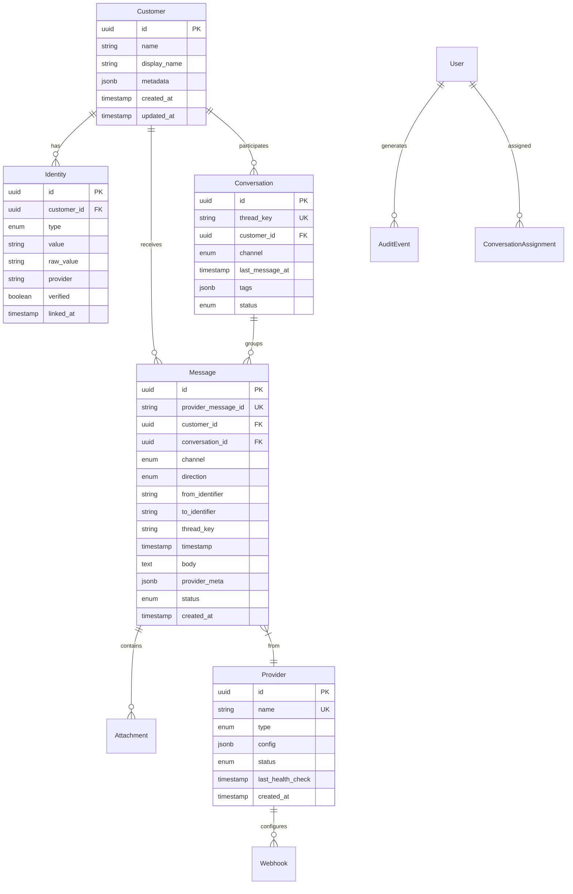

# Data Model Specification

**Feature**: Unified CRM Correspondence Platform  
**Date**: 2025-09-09  
**Phase**: 1 - Design & Contracts

## Schema Overview



## Table Definitions

### customers
Primary entity representing individuals who communicate with the organization.

| Column | Type | Constraints | Description |
|--------|------|------------|-------------|
| id | UUID | PRIMARY KEY, DEFAULT gen_random_uuid() | Unique identifier |
| name | VARCHAR(255) | | Full name (may be inferred) |
| display_name | VARCHAR(100) | | Preferred display name |
| metadata | JSONB | DEFAULT '{}' | Custom fields, notes |
| created_at | TIMESTAMP | NOT NULL, DEFAULT NOW() | Record creation |
| updated_at | TIMESTAMP | NOT NULL, DEFAULT NOW() | Last modification |

**Indexes**:
- `idx_customers_name`: GIN index on name for full-text search
- `idx_customers_created`: On created_at DESC for recent customers

### identities
Links various communication identifiers to a customer.

| Column | Type | Constraints | Description |
|--------|------|------------|-------------|
| id | UUID | PRIMARY KEY | Unique identifier |
| customer_id | UUID | FOREIGN KEY(customers) ON DELETE CASCADE | Parent customer |
| type | ENUM | NOT NULL | 'phone', 'email', 'social' |
| value | VARCHAR(255) | NOT NULL | Normalized identifier |
| raw_value | VARCHAR(255) | NOT NULL | Original format |
| provider | VARCHAR(50) | | Source provider (optional) |
| verified | BOOLEAN | DEFAULT FALSE | Verification status |
| linked_at | TIMESTAMP | NOT NULL, DEFAULT NOW() | When linked |

**Indexes**:
- `idx_identities_lookup`: UNIQUE(type, value) for fast resolution
- `idx_identities_customer`: On customer_id for relationship queries

### messages
Canonical storage for all communication events.

| Column | Type | Constraints | Description |
|--------|------|------------|-------------|
| id | UUID | PRIMARY KEY | Internal identifier |
| provider_message_id | VARCHAR(255) | NOT NULL | Provider's ID |
| provider_id | UUID | FOREIGN KEY(providers) | Source provider |
| customer_id | UUID | FOREIGN KEY(customers) ON DELETE SET NULL | Associated customer |
| conversation_id | UUID | FOREIGN KEY(conversations) ON DELETE SET NULL | Thread grouping |
| channel | ENUM | NOT NULL | 'sms', 'email', 'voice', 'whatsapp', 'facebook', 'instagram' |
| direction | ENUM | NOT NULL | 'inbound', 'outbound' |
| from_identifier | VARCHAR(255) | NOT NULL | Sender identifier |
| to_identifier | VARCHAR(255) | NOT NULL | Recipient identifier |
| thread_key | VARCHAR(255) | | Grouping key |
| timestamp | TIMESTAMP | NOT NULL | Message time |
| body | TEXT | | Message content |
| provider_meta | JSONB | DEFAULT '{}' | Provider-specific data |
| status | ENUM | DEFAULT 'received' | 'received', 'processed', 'failed' |
| created_at | TIMESTAMP | NOT NULL, DEFAULT NOW() | Ingestion time |

**Indexes**:
- `idx_messages_dedup`: UNIQUE(provider_id, provider_message_id) for idempotency
- `idx_messages_customer_time`: On (customer_id, timestamp DESC) for timeline
- `idx_messages_conversation`: On conversation_id for thread queries
- `idx_messages_search`: GIN index on body for full-text search

### conversations
Groups related messages into threads.

| Column | Type | Constraints | Description |
|--------|------|------------|-------------|
| id | UUID | PRIMARY KEY | Unique identifier |
| thread_key | VARCHAR(255) | UNIQUE, NOT NULL | Thread identifier |
| customer_id | UUID | FOREIGN KEY(customers) ON DELETE CASCADE | Primary participant |
| channel | ENUM | NOT NULL | Primary channel |
| last_message_at | TIMESTAMP | | Most recent message |
| tags | JSONB | DEFAULT '[]' | User-defined tags |
| status | ENUM | DEFAULT 'active' | 'active', 'archived', 'assigned' |
| created_at | TIMESTAMP | NOT NULL, DEFAULT NOW() | Thread creation |
| updated_at | TIMESTAMP | NOT NULL, DEFAULT NOW() | Last modification |

**Indexes**:
- `idx_conversations_customer`: On customer_id
- `idx_conversations_status`: On status for filtering
- `idx_conversations_tags`: GIN index on tags for tag search

### attachments
Media and documents associated with messages.

| Column | Type | Constraints | Description |
|--------|------|------------|-------------|
| id | UUID | PRIMARY KEY | Unique identifier |
| message_id | UUID | FOREIGN KEY(messages) ON DELETE CASCADE | Parent message |
| type | VARCHAR(50) | NOT NULL | MIME type |
| filename | VARCHAR(255) | | Original name |
| size | INTEGER | | File size in bytes |
| storage_url | TEXT | NOT NULL | S3/storage location |
| thumbnail_url | TEXT | | Preview image URL |
| metadata | JSONB | DEFAULT '{}' | Additional properties |
| created_at | TIMESTAMP | NOT NULL, DEFAULT NOW() | Upload time |

**Indexes**:
- `idx_attachments_message`: On message_id

### users
System users (admin, staff, viewers).

| Column | Type | Constraints | Description |
|--------|------|------------|-------------|
| id | UUID | PRIMARY KEY | Unique identifier |
| email | VARCHAR(255) | UNIQUE, NOT NULL | Login email |
| name | VARCHAR(255) | NOT NULL | Display name |
| role | ENUM | NOT NULL | 'admin', 'staff', 'viewer' |
| metadata | JSONB | DEFAULT '{}' | Preferences, settings |
| last_login | TIMESTAMP | | Last access time |
| created_at | TIMESTAMP | NOT NULL, DEFAULT NOW() | Account creation |
| updated_at | TIMESTAMP | NOT NULL, DEFAULT NOW() | Last modification |

**Indexes**:
- `idx_users_email`: UNIQUE on email
- `idx_users_role`: On role for permission queries

### providers
Configuration for external communication services.

| Column | Type | Constraints | Description |
|--------|------|------------|-------------|
| id | UUID | PRIMARY KEY | Unique identifier |
| name | VARCHAR(100) | UNIQUE, NOT NULL | Display name |
| type | ENUM | NOT NULL | 'twilio_sms', 'gmail', 'twilio_voice', 'whatsapp', 'facebook', 'instagram' |
| config | JSONB | NOT NULL | Encrypted credentials |
| status | ENUM | DEFAULT 'inactive' | 'active', 'inactive', 'error' |
| last_health_check | TIMESTAMP | | Last verification |
| error_message | TEXT | | Latest error if any |
| created_at | TIMESTAMP | NOT NULL, DEFAULT NOW() | Setup time |
| updated_at | TIMESTAMP | NOT NULL, DEFAULT NOW() | Last modification |

**Indexes**:
- `idx_providers_type`: On type
- `idx_providers_status`: On status for health monitoring

### webhooks
Webhook endpoint configurations per provider.

| Column | Type | Constraints | Description |
|--------|------|------------|-------------|
| id | UUID | PRIMARY KEY | Unique identifier |
| provider_id | UUID | FOREIGN KEY(providers) ON DELETE CASCADE | Parent provider |
| endpoint_url | TEXT | NOT NULL | Webhook URL |
| secret | TEXT | | Signing secret (encrypted) |
| events | JSONB | DEFAULT '[]' | Subscribed events |
| status | ENUM | DEFAULT 'active' | 'active', 'inactive' |
| last_received | TIMESTAMP | | Last webhook time |
| created_at | TIMESTAMP | NOT NULL, DEFAULT NOW() | Configuration time |

**Indexes**:
- `idx_webhooks_provider`: On provider_id

### audit_events
Compliance and security audit trail.

| Column | Type | Constraints | Description |
|--------|------|------------|-------------|
| id | UUID | PRIMARY KEY | Unique identifier |
| timestamp | TIMESTAMP | NOT NULL, DEFAULT NOW() | Event time |
| user_id | UUID | FOREIGN KEY(users) ON DELETE SET NULL | Acting user |
| action | VARCHAR(100) | NOT NULL | Action type |
| resource_type | VARCHAR(50) | NOT NULL | Entity type |
| resource_id | VARCHAR(255) | | Entity ID |
| metadata | JSONB | DEFAULT '{}' | Context data |
| ip_address | INET | | Client IP |
| user_agent | TEXT | | Browser/client info |

**Indexes**:
- `idx_audit_user_time`: On (user_id, timestamp DESC)
- `idx_audit_resource`: On (resource_type, resource_id)
- `idx_audit_timestamp`: On timestamp DESC for compliance queries

### conversation_assignments
Staff assignment tracking.

| Column | Type | Constraints | Description |
|--------|------|------------|-------------|
| id | UUID | PRIMARY KEY | Unique identifier |
| conversation_id | UUID | FOREIGN KEY(conversations) ON DELETE CASCADE | Thread |
| user_id | UUID | FOREIGN KEY(users) ON DELETE CASCADE | Assigned staff |
| assigned_at | TIMESTAMP | NOT NULL, DEFAULT NOW() | Assignment time |
| assigned_by | UUID | FOREIGN KEY(users) | Assigning user |
| notes | TEXT | | Assignment notes |

**Indexes**:
- `idx_assignments_conversation`: UNIQUE(conversation_id) - one active assignment
- `idx_assignments_user`: On user_id for workload queries

## Data Constraints & Business Rules

### Identity Resolution Rules
1. Phone numbers normalized to E.164 format
2. Emails normalized to lowercase
3. Social handles stored with provider prefix
4. Duplicate prevention via unique index
5. Soft-linking with verification flag

### Message Deduplication
1. Unique constraint on (provider_id, provider_message_id)
2. Upsert operations use ON CONFLICT DO NOTHING
3. Timestamp used from provider, not ingestion time
4. Failed messages retry with same ID

### Conversation Threading
1. Thread key derived from provider's conversation/thread ID
2. SMS: Combination of sender and recipient numbers
3. Email: Gmail thread ID or In-Reply-To header
4. Social: Platform's conversation/chat ID
5. Fallback to individual messages if no threading

### Privacy & Retention
1. PII fields encrypted at rest using column-level encryption
2. Audit events retained for 7 years (immutable)
3. Messages soft-deleted with 30-day recovery window
4. Customer merge maintains audit trail
5. Right-to-erasure via anonymization, not deletion

### Status Transitions

**Message Status**:
```
received → processed
received → failed (on error)
failed → processed (on retry)
```

**Conversation Status**:
```
active ↔ assigned (staff assignment)
active → archived (manual/time-based)
archived → active (new message)
```

**Provider Status**:
```
inactive → active (successful config)
active → error (health check fail)
error → active (recovery)
active → inactive (manual disable)
```

## Migration Considerations

### Initial Schema Creation
```sql
-- Enable required extensions
CREATE EXTENSION IF NOT EXISTS "uuid-ossp";
CREATE EXTENSION IF NOT EXISTS "pg_trgm"; -- For fuzzy text search

-- Create enums
CREATE TYPE identity_type AS ENUM ('phone', 'email', 'social');
CREATE TYPE channel_type AS ENUM ('sms', 'email', 'voice', 'whatsapp', 'facebook', 'instagram');
CREATE TYPE message_direction AS ENUM ('inbound', 'outbound');
CREATE TYPE message_status AS ENUM ('received', 'processed', 'failed');
CREATE TYPE user_role AS ENUM ('admin', 'staff', 'viewer');
CREATE TYPE provider_type AS ENUM ('twilio_sms', 'gmail', 'twilio_voice', 'whatsapp', 'facebook', 'instagram');
CREATE TYPE provider_status AS ENUM ('active', 'inactive', 'error');
CREATE TYPE conversation_status AS ENUM ('active', 'archived', 'assigned');

-- Tables created in dependency order
CREATE TABLE customers...
CREATE TABLE identities...
CREATE TABLE providers...
CREATE TABLE conversations...
CREATE TABLE messages...
-- etc.
```

### Data Seeding Strategy
1. Create default admin user
2. Add sample providers (inactive)
3. Import historical data if available
4. Generate test messages for development

### Performance Optimization
1. Partition messages table by month after 1M records
2. Archive old conversations to cold storage
3. Implement read replicas for analytics
4. Consider TimescaleDB for time-series optimization

---
*Data model designed for: Scalability, Compliance, Extensibility*